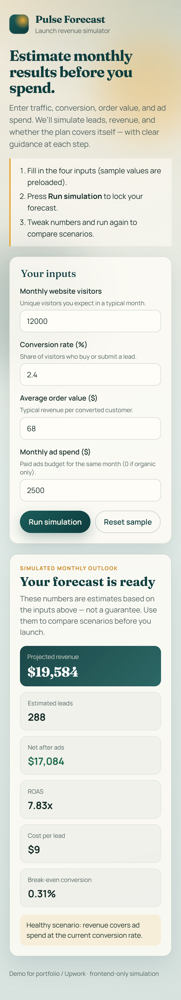
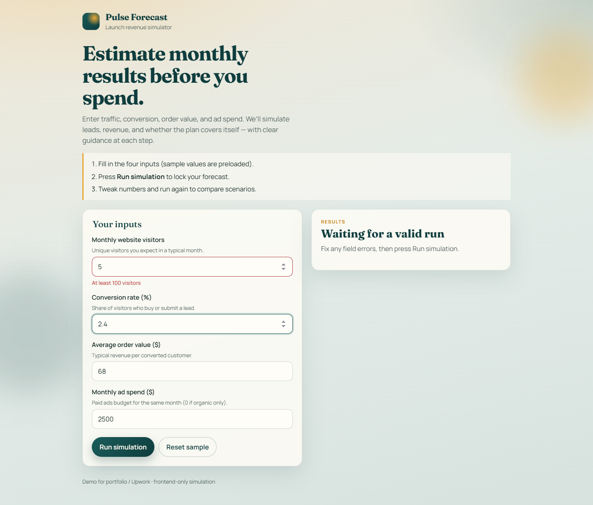

# Pulse Forecast — Input Form & Simulated Results Demo

A small, responsive web app that collects user inputs, validates them in real time, and shows a clear simulated result.

**Live demo:** https://sim-results.pages.dev/


## What it does

Visitors enter four values:

- Monthly website visitors
- Conversion rate (%)
- Average order value ($)
- Monthly ad spend ($)

The app then simulates a monthly outlook:

- Projected revenue
- Estimated leads
- Net result after ad spend
- ROAS (return on ad spend)
- Cost per lead
- Break-even conversion rate

Each result comes with a one-line, plain-language explanation of what it means.

## UX decisions

- **Guided start** – a short intro and 3-step guide at the top, with sample values preloaded so the page never looks empty.
- **Clear fields** – every input has a label, a one-line hint and sensible limits.
- **Inline validation** – errors appear directly under the field in plain words, and the result panel waits for valid data instead of showing wrong numbers.
- **Result-first layout** – the key number is highlighted, supporting figures follow in simple cards.
- **Mobile friendly** – single-column layout on phones, numeric keyboards, and large tap targets.

<table>
  <tr>
    <td width="30%"></td>
    <td></td>
  </tr>
  <tr>
    <td align="center">Mobile layout</td>
    <td align="center">Inline validation</td>
  </tr>
</table>

## Tech stack

- React + TypeScript
- Vite
- React Hook Form + Zod for form state and validation
- Plain CSS (responsive, no UI framework)
- Deployed on Cloudflare Pages

The simulation logic lives in [`src/sim.ts`](src/sim.ts), separate from the UI, so the formulas can be swapped or tested independently.

## Run locally

```bash
npm install
npm run dev
```

Production build:

```bash
npm run build
```

The static site is generated in `dist/` and can be hosted on any static host (Cloudflare Pages, Vercel, Netlify).
